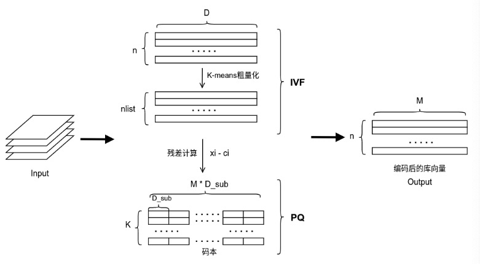

# 寒武纪 CNIndex 使用指南

## 目录

- [寒武纪 CNIndex 使用指南](#寒武纪-cnindex-使用指南)
  - [目录](#目录)
  - [1 介绍](#1-介绍)
  - [2 前提条件](#2-前提条件)
  - [3 环境准备](#3-环境准备)
  - [4 源码编译](#4-源码编译)
  - [5 编程模型](#5-编程模型)
    - [5.1 异构编程模型](#51-异构编程模型)
    - [5.2 编程指南](#52-编程指南)
  - [6 索引支持](#6-索引支持)
    - [6.1 FLAT](#61-flat)
    - [6.2 PQ](#62-pq)
    - [6.3 IVFPQ](#63-ivfpq)
  - [7 samples运行](#7-samples运行)
  - [8 性能精度测试](#8-性能精度测试)
  - [9 功能特性](#9-功能特性)
    - [9.1 API日志](#91-api日志)
    - [9.2 精度特性](#92-精度特性)
      - [9.2.1 索引精度变化说明](#921-索引精度变化说明)
      - [9.2.2 索引精度误差说明](#922-索引精度误差说明)
      - [9.2.3 二次内存管理](#923-二次内存管理)
      - [9.2.4 线程安全](#924-线程安全)
  - [10 CNIndex 环境变量](#10-cnindex-环境变量)
    - [10.1 CNINDEX\_LOG\_FILTER](#101-cnindex_log_filter)
    - [10.2 CNINDEX\_LOG\_LEVEL](#102-cnindex_log_level)

## 1 介绍

寒武纪CNIndex（Cambricon Index Library，寒武纪索引库）是一个基于寒武纪机器学习单元（MLU）以及寒武纪CNNL_EXTRA（寒武纪人工智能计算扩展库）对各类向量相似度搜索应用场景提供向量搜索的计算库。

CNIndex针对此类应用场景，提供了高度优化的索引类型，同时也为用户提供简洁、高效、通用、灵活的编程接口。 

CNIndex主要支持如下特性：

* 支持丰富的索引类型：

  – FLAT

  – PQ（Product Quantization，乘积量化）

  – IVFPQ（Invert File System Product Quantization，倒排乘积量化）
* 设计过程以通用性为基本原则，索引类型支持灵活的数据维度、多样的参数配置，以及简单易用的接口使用方法。
* 结合寒武纪的硬件架构特点，优化索引计算过程，使索引计算具有最佳性能：
  
  – 采用内存二次管理模块BFC Allocator优化MLU内存指针管理，极大地提升了内存申请释放的效率，提高了向量搜索、增加底库的吞吐能力。

  – 采用SIMD（Single Instruction Multiple Data，单指令多数据流）指令加速向量运算，提高数据并行处理能力。

  – 使用线程池模块并行化向量运算，在低主频的CPU上性能提升明显。

  – 采用pipeline方式进行多batch查询，充分利用CPU和MLU计算重叠时间。
* 提供配置设备管理的接口，通过合理地配置设备资源，满足用户多线程、多板卡的应用场景。
* 屏蔽底层硬件差异，用户可以轻松在寒武纪不同类型硬件平台上使用。

## 2 前提条件

* Linux 常见操作系统版本(如 Ubuntu16.04，Ubuntu18.04，CentOS7.x 等)，安装 docker(>=v18.00.0)应用程序；
* 服务器装配好寒武纪 200/300 系列及以上的智能加速卡，并安装好驱动(>=v4.20.6)；
* 若不具备以上软硬件条件，可前往寒武纪开发者社区申请试用;

## 3 环境准备

若基于寒武纪云平台环境可跳过该环节。否则需运行以下步骤：

1.请前往[寒武纪开发者社区](https://developer.cambricon.com/)下载 MagicMind(version >= 1.0.2)镜像，名字如下：

magicmind_version_os.tar.gz, 例如 magicmind_1.0.2-1_ubuntu18.04.tar.gz

2.加载：

```bash
docker load -i magicmind_version_os.tar.gz
```

3.运行：

```bash
docker run -it --name=dockername \
           --network=host --cap-add=sys_ptrace \
           -v /your/host/path/MagicMind:/MagicMind \
           -v /usr/bin/cnmon:/usr/bin/cnmon \
           --device=/dev/cambricon_dev0:/dev/cambricon_dev0 --device=/dev/cambricon_ctl \
           -w ${cnindex_dir} magicmind_version_image_name:${container_name} /bin/bash
```

其中：
- ${cnindex_dir} CNIndex 源码所在目录
- ${container_name} ：用户自定义的容器名称


## 4 源码编译

初始化环境变量:
```bash
source env.sh
```

编译:

```bash
$ make 
```

## 5 编程模型

### 5.1 异构编程模型

异构计算系统通常由通用处理器和协处理器组成，其中通用处理器作为控制设备，通常称为Host端(主机端)，负责调度。协处理器作为辅助计算设备，即MLU端(设备端)，负责专有领域的大规模并行计算。Host端和MLU端协同完成计算任务。

寒武纪CNIndex异构编程模型是CPU和MLU的协作编程模型。Host端负责调用CNIndex接口用来初始化设备、管理设备内存、准备参数、调用索引搜索接口以及释放设备资源。MLU端作为协处理器，帮助CPU即Host端完成向量搜索任务，并达到低功耗、高性能的效果。CNIndex库的每个索引由Host端CPU发射，在MLU端异步执行。 

### 5.2 编程指南

下面以IVFPQ索引为例，具体介绍如何创建和使用一个CNIndex索引：

1. 构建Flat对象，调用flat索引构造函数构建flat对象及绑定当前线程所使用的MLU设备id。IVF粗聚类中心的向量将存储在Flat索引中。
2. 准备IVF粗聚类中心向量，调用cnindex::Flat::Add()传入准备好的向量，添加粗聚类中心并且拷贝到MLU设备。
3. 构建IVFPQ对象，调用ivfpq索引构造函数，将准备好的flat连同其它数据作为参数传入。
4. 准备PQ聚类中心，调用cnindex::IVFPQ::SetCentroids()进行添加。
5. 调用cnindex::IVFPQ::Add()进行向量添加，将向量编码为压缩后的码本。
6. 调用cnindex::IVFPQ::Search()进行向量搜索。
7. 调用cnindex::IVFPQ::Remove()删除向量。这一步可以根据需要自行选择。
   
完整请参考```${CNINDEX_PATH}/sample/sample_cnindex_ivfpq.cpp```样例。

## 6 索引支持

### 6.1 FLAT

FLAT是最简单的索引类型，适用于需要100%召回率且数据规模相对较小的向量相似性搜索场景。FLAT对向量进行原始文件存储，是唯一可以保证精确检索结果的索引。对于每个查询，FLAT都要将目标输入与底库中的每个向量进行比较，因此FLAT的查询速度是最慢的，而且不适用于大规模查询。

**规格限制**
* FLAT目前支持L2和IP(Inner product)距离计算方式。
* 输入向量维度dim限制为256/512/1024。
* CNIndex中使用FLAT索引不需要数据训练。
具体使用请参考${CNINDEX_PATH}/sample样例

### 6.2 PQ

PQ（Product Quantization，乘积量化）会将原来的高维向量空间均匀分解成m个低维向量空间的笛卡尔积，然后对分解得到的低维向量空间分别做矢量量化。最终每条向量会存储在m × nbits个bit位里。乘积量化能将全样本的距离计算转化为到各低维空间聚类中心的距离计算，从而大大降低算法的时间复杂度。

**规格限制**

* PQ目前仅支持L2距离计算方式。
* 输入向量维度dim限制为256/512/1024。
* PQ量化的向量子空间个数M限制为32/64。
* 输入向量分解成每个低维向量的存储位数nbits限制为8。

具体使用请参考${CNINDEX_PATH}/sample样例

### 6.3 IVFPQ

IVFPQ(Invert File System Product Quantization)索引是在PQ量化的基础上，先对所有样本进行IVF索引聚类，使聚类和量化后的库向量相比于普通量化更小，更容易存储。

IVFPQ的搜索主要包含3个步骤:
1. 粗搜索，将输入的特征向量(queries)与粗聚类中心计算L2距离，选出若干个（nprobe）被查询的桶;
2. 残差计算，将输入的特征向量与粗聚类中心做残差;
3. 搜索并选取topK，将残差计算后的输入向量与第一步中选出的底库向量计算L2距离，并输出距离最近的topK个特征向量的距离与id。

主要流程如下：


**规格限制**

* IVFPQ目前仅支持L2距离计算方式。
* 输入向量维度dim限制为256/512/1024。
* PQ量化的向量子空间个数M限制为32/64。
* 输入向量分解成每个低维向量的存储位数nbits限制为8。

具体使用请参考${CNINDEX_PATH}/sample样例。

## 7 samples运行

编译:
```bash
cd ${CNINDEX_PATH}/sample
$ mkdir bin && cd bin && cmake .. && make
```

运行相应 sample_xxx 程序：

```bash
cd ${CNINDEX_PATH}/sample/bin
$ ./sample_flat
```

运行结果展示:
```bash
Flat3::Flat3(L2)
flat.Add() sucess
cnindex FlatSearch sucess
cnindex FlatRemove sucess! ntotal = 1024, remove = 512, after remove = 512
cnindex FlatReset sucess! after reset size = 0
Flat3::~Flat3()
```

python版本运行:

```bash
cd py
python test_pq.py --device_id 0 --mode_set s --nq 10 --d 256 --M 32 --nbits 8 --ntotal 400 --topk 1
python test_flat.py --device_id 0 --mode_set s --nq 10 --d 256 --ntotal 400 --topk 1
```

## 8 性能精度测试

```bash
cd ${CNINDEX_PATH}/test
$run_test_cnindex_flat.sh 
$run_test_cnindex_ivfpq.sh
$run_test_cnindex_pq.sh
```

可通过在run_test_cnindex_flat.sh中设置如下参数,进行功能测试选择

```bash
TEST_SEARCH_RANDOM_DATASET=1
TEST_ADD=0
TEST_REMOVE=0
```

部分运行结果如下所示:
```bash
Flat3::Flat3(L2)

-------------- FLAT SEARCH ACCURACY TEST --------------
Search dataset:  random
       nquery:   1
       d:        256
       ntotal:   131072
       topk:     1


------------ FLAT SEARCH PERFORMANCE TEST -------------
Search dataset:  random
       nquery:   1
       d:        256
       ntotal:   131072
       topk:     1

MLU Search OK
MLU E2Etime: 752.078us (1504.16/2), 1329.65qps
-------------------------------------------------------
```
## 9 功能特性

### 9.1 API日志

执行下面步骤，设置打印API日志：

1. 调用CNindex函数时，在想要打印信息的位置输入下面指令。用户需要在指令中选择日志级别为INFO、WARNING、ERROR或FATAL，并且在双引号中输入想要打印在屏幕上的内容。

```bash
LOGI()/LOGW()/LOGE()/LOGF()<<"Information printed on the screen.
```
2. 在运行CNIndex前，设置LOG_LEVEL环境变量指定日志的最小打印级别。
   
    例如在调用CNindex函数时，输入下面指令：
```
LOGI()<<"Information printed on the screen.";
LOFW()<<"Information printed on the screen.";
LOGE()<<"Information printed on the screen.";
LOGF()<<"Information printed on the screen.";
```

如果在环境变量中设置为WARNING，则只会在屏幕上打印LOFW()、LOGE()、LOGF()的所有内容，而不打印LOGI()的内容。详情请查看CNIndex环境变量。

### 9.2 精度特性

#### 9.2.1 索引精度变化说明

在相同的硬件架构下, CNIndex软件版本的索引计算的精度依赖于底层算子库版本，原因如下：

1. CNIndex库调用了CNNL_EXTRA算子库中的算子。算子包含计算流程如卷积计算、规约计算、激活计算等，不同版本的算子内部算法设计可能会影响这些计算流程的精度。

2. CNIndex不同索引类型使用了不同的算法设计，计算过程中涉及的如浮点数累加、累乘、平均、平方根等计算均可能受软件版本的影响。 

#### 9.2.2 索引精度误差说明

由于运算单元异构的原因，使用MLU进行计算时将会与CPU计算的结果有一定的精度误差。经过反复测试，对于CNIndex库中可能存在的精度误差做出以下说明：

1. IVFPQ索引的add接口中，由于计算距离时使用的浮点运算单元精度差异，在添加较大底库时，个别聚类中心的个别向量，会出现某一字节中MLU的PQ编码和CPU不一致的情况。

2. IVFPQ索引的search接口中，由于计算距离时使用的浮点运算单元精度差异，当底库向量a和b，与查询向量的距离相近时，存在cpu返回topk的序列为[...ab...]，mlu返回的topk序列为[...ba...]，即最终选择出的ID位置互换的情况。此情况如果发生在topk的最后一个向量，则呈现的结果是最后一个向量不同。

以上存在的精度误差，基本不会影响搜索结果。

#### 9.2.3 二次内存管理

寒武纪MLU平台提供了最基础的CNRT内存管理系统，在CNIndex的实现过程中，遇到了如下情况:

1. 索引实现的部分接口在调用底层算子时需要有一块或多块临时的MLU内存用于工作区、传入输入数据或传出输出结果.

2. 类似IVFPQ之类的索引需要管理nlist块内存空间来维护其内的编码向量和ID，而在底库向量的增减过程中，必定会引发内存的重新分配。

3. 多个索引实例将带来多倍数的MLU内存指针管理需求。

如果上述1和2的情况频繁发生且在多实例MLU内存指针较多时（>200000个），CNRT内存管理系统设备端所维护的内存分配链表将变得非常低效，此时内存分配和释放将成为系统的瓶颈。引入二次内存管理模块能极大缓解这个问题。

CNIndex移植了开源代码TensorFlow的二次内存管理模块BFC Allocator。BFC Allocator是dlmalloc的一个简单实现版本。BFC的全称是Best‑Fit with Coalescing，该算法通过Chunk和Bin实现了非常高效的按需分配和存储区回收的机制，并尽可能减少存储碎片。

采用二次内存管理模块后，以IVFPQ为例，最终可将吞吐（QPS）从由CNRT直接管理内存时的<50%提高至>95%（数据基于单个索引实例的吞吐性能).

#### 9.2.4 线程安全

CNIndex具有严格线程安全，允许多个线程共享同一个CNIndex实例，并且保证实例中的每个接口安全。

## 10 CNIndex 环境变量

### 10.1 CNINDEX_LOG_FILTER

**功能描述**

选择需要的索引类型，并设置其log日志是否打开。

**使用方法**
* export CNINDEX_LOG_FILTER=IVFPQ:2,IVFSQ:3 ...

### 10.2 CNINDEX_LOG_LEVEL

**功能描述**

设置log宏的最小打印级别，屏蔽不需要级别的日志信息。
**使用方法**
* export CNINDEX_LOG_LEVEL=1：显示FATAL级别日志
* export CNINDEX_LOG_LEVEL=2：显示ERROR级别日志
* export CNINDEX_LOG_LEVEL=3：显示WARNING级别日志
* export CNINDEX_LOG_LEVEL=4：显示INFO级别日志
* export CNINDEX_LOG_LEVEL=5：显示DEBUG级别日志
* export CNINDEX_LOG_LEVEL=6：显示TRACE级别日志
* export CNINDEX_LOG_LEVEL=7：显示VERBOSE级别日志

## Release notes

### v1.0.0

更新时间：2023年1月31日
更新内容：初始版本
